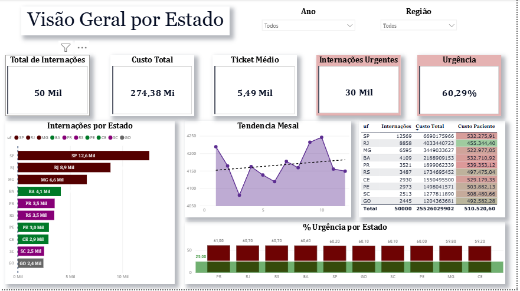
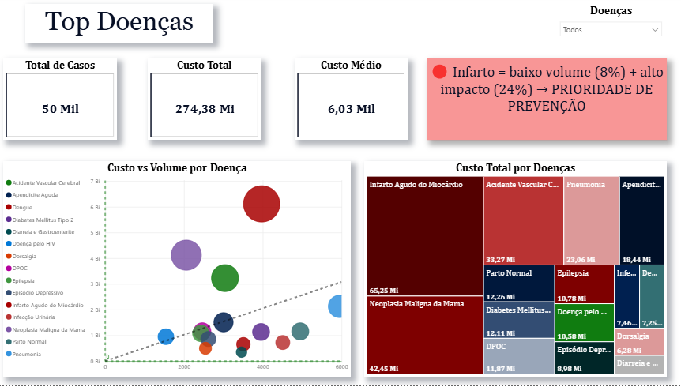
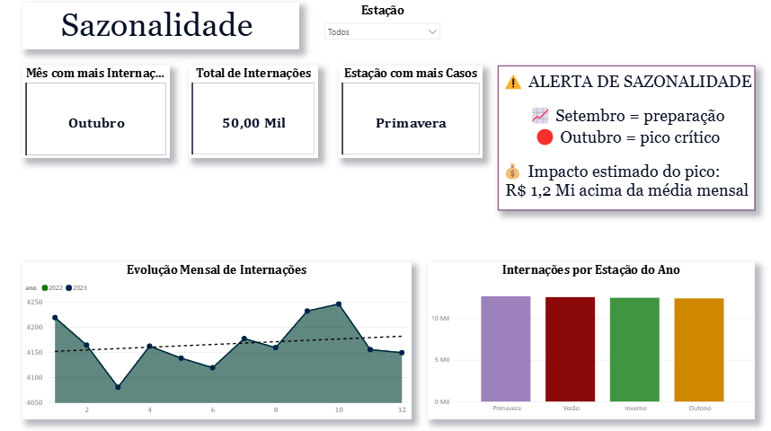
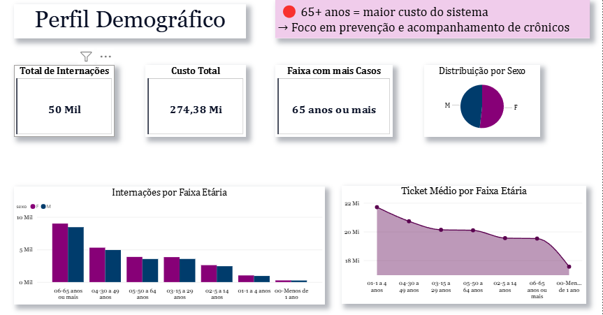
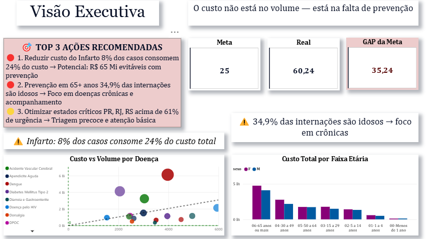

# 🏥 SUS Decision Intelligence

## 📊 Sobre o Projeto

Plataforma de análise estratégica baseada em dados do SIH/DATASUS, focada em transformar dados públicos de saúde em decisões acionáveis.

Este projeto vai além da visualização tradicional, incorporando análise de impacto, priorização e inteligência operacional.

---

## 🧠 O que torna este projeto diferente

Este não é apenas um dashboard.

Ele responde perguntas críticas como:

- Onde o sistema está gastando mais?
- Quais doenças geram maior impacto financeiro?
- Quando ocorrem os picos críticos?
- Qual perfil populacional gera maior custo?

---

## ⚙️ Arquitetura

- Ingestão: DATASUS
- Transformação: dbt Core
- Armazenamento: DuckDB
- Visualização: Power BI

---

## 📈 Principais Insights

- Infarto representa baixo volume (~8%) mas alto impacto (~24%) → foco em prevenção
- Outubro é o mês crítico de internações → planejamento antecipado
- 65+ anos concentram maior custo do sistema
- Estados como SP, RJ e PR apresentam alta urgência

---

## 🚀 Camadas Analíticas

### 1. Visão Geral
Análise por estado com custo, volume e urgência

### 2. Top Doenças
Correlação entre custo e volume (identificação de alto impacto)

### 3. Sazonalidade
Identificação de picos e tendências

### 4. Perfil Demográfico
Análise por faixa etária e sexo

### 5. Visão Executiva
Recomendações estratégicas e priorização de ações

---

## 🎯 Decisão Estratégica

> O custo não está no volume — está na falta de prevenção.

---

## 📸 Dashboard







---

## ▶️ Como executar

```bash
pip install -r requirements.txt
dbt run